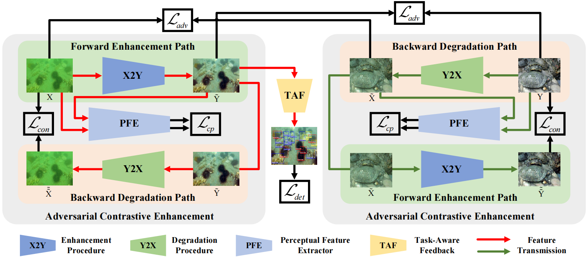

# Twin-Adversarial-Contrastive-Learning-for-Underwater-Image-Enhancement-and-Beyond
This is an implement of the TACL,
**“[Twin-Adversarial-Contrastive-Learning-for-Underwater-Image-Enhancement-and-Beyond](https://ieeexplore.ieee.org/document/9832540)”**, 
Risheng Liu*, Zhiying Jiang, Shuzhou Yang, Xin Fan, IEEE Transactions on Image Processing __(TIP)__, 2022.

## Overview


## Prerequisites
- Linux or macOS
- Python 3
- CPU or NVIDIA GPU + CUDA CuDNN

## Installation
Type the command:
```
pip install -r requirements.txt
```

## Download
Download the pre-trained model and put it in _./checkpoints_
- [Google Drive](https://drive.google.com/file/d/1MQkXjzEFYubDsc7aBhAmX7FjcvHnvZ2D/view?usp=sharing)

## Quick Run
Put the images you want to process in the _./datasets_ folder. \
To test the pre-trained models for Underwater Enhancement on your own images, run
​```
python test.py --dataroot ./datasets/[YOUR-DATASETS] --name underwater --model cycle_gan
​``` \
Results will be shown in _results_ folder.

## Contact
Should you have any question, please contact [Shuzhou Yang].

[Shuzhou Yang]:yszdyx@gmail.com